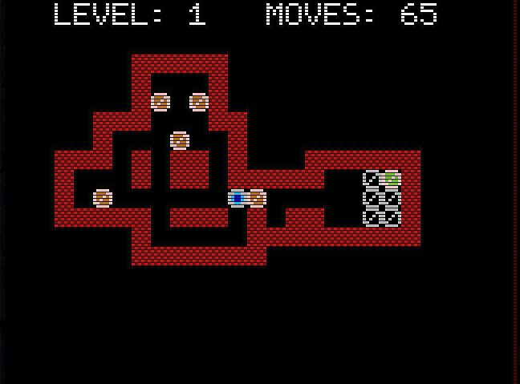

# Sokoban for the GIGATRON

The Gigatron is a 1980's style computer consisting of just a handful of 7400 series TTL chips.
Everything about the Gigatron can be found here:

https://gigatron.io/

https://forum.gigatron.io/

## My Version gtsokoban

The program file was created with the compiler gtBASIC v1.0.9R. Changes may be necessary for other versions.

https://forum.gigatron.io/viewtopic.php?t=232

To create the graphics for the game the software paint.net was used.

https://www.getpaint.net/

There are two versions of the game. One for the Gigatron with 32k RAM and one for all Gigatron with 64k and more.
The 32k version has only 66 levels compared to the 64k version with 90 levels.

#### Operation:
- The arrow keys on the keyboard or gamepad move the player.
- The key + or B on the gamepad change to the next level.
- The key - or A on the gamepad switch to the previous level, for level 1 to the last one in the game.
- The n/N or Start button on the gamepad restarts the current level.
- The r/R or Select key on the gamepad will undo the last move made. Up to 50 moves can be undone.
